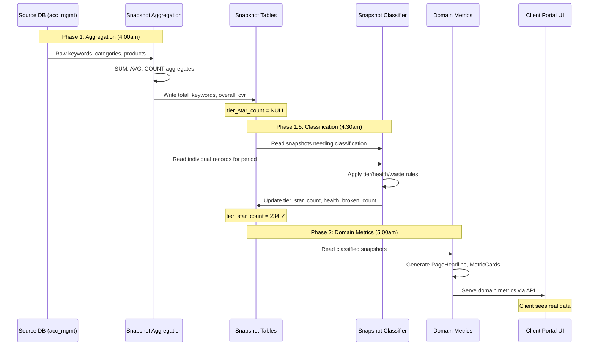

# Snapshot System Architecture

## Overview

The Snapshot System consists of **three separate services** that work together to provide pre-computed analytics data:

```
┌─────────────┐
│ Source DB   │ (acc_mgmt via tunnel)
│ - keywords  │
│ - categories│
│ - products  │
└──────┬──────┘
       │ Raw data (daily updates)
       ▼
┌──────────────────────────────────────┐
│  PHASE 1: Aggregation Service        │
│  services/snapshot-generator/        │
│                                      │
│  - Reads raw source data             │
│  - Groups by month/retailer          │
│  - Computes SUM, AVG, COUNT          │
│  - Stores in snapshot tables         │
│  - NO classification/analysis        │
└──────┬───────────────────────────────┘
       │ Pre-aggregated metrics
       ▼
┌──────────────────────────────────────┐
│  ShareView DB (shareview)            │
│  Snapshot Tables:                    │
│  - keywords_snapshots                │
│  - category_performance_snapshots    │
│  - product_performance_snapshots     │
│  - auction_insights_snapshots        │
│  - product_coverage_snapshots        │
└──────┬───────────────────────────────┘
       │ Raw aggregates
       ▼
┌──────────────────────────────────────┐
│  PHASE 1.5: Classification Service   │
│  services/snapshot-classifier/       │
│                                      │
│  - Reads raw rows for the period     │
│  - Applies tier/health rules         │
│  - Computes concentration & waste    │
│  - Updates snapshot classifications  │
└──────┬───────────────────────────────┘
  │ Classified snapshots
  ▼
┌──────────────────────────────────────┐
│  PHASE 2: Domain Metrics Service     │
│  services/domain-metrics-generator/  │
│                                      │
│  - Builds UI-ready metric cards      │
│  - Generates page headlines          │
│  - Writes domain_metrics records     │
└──────┬───────────────────────────────┘
  │ Classified data
  ▼
┌──────────────────────────────────────┐
│  Client Applications                 │
│  - Web UI (Next.js)                  │
│  - API consumers                     │
│  - Reports                           │
└──────────────────────────────────────┘
```

## Why Three Phases?

### Separation of Concerns
- **Aggregation** = Pure data transformation (stable, rarely changes)
- **Classification** = Algorithmic rules applied to raw rows
- **Domain metrics** = UI-ready insights and components

### Performance Benefits
- Aggregation runs once, analysis can run multiple times with different rules
- Snapshots serve as materialized views for fast queries
- Analysis can be parallelized per retailer/domain

### Flexibility
- Change tier thresholds without re-aggregating source data
- A/B test different classification rules
- Client-specific analysis logic (different retailers, different rules)

## Phase 1: Aggregation Service (Current)

### Responsibilities
✅ Read raw source data (keywords, categories, products)  
✅ Detect months with updated data  
✅ Compute aggregate metrics (SUM, AVG, COUNT)  
✅ Store in snapshot tables via idempotent upserts  
✅ Handle change detection (only process updated months)  

### What it DOES NOT do
❌ Classify tiers (star/strong/underperforming)  
❌ Calculate health status (broken/healthy/attention)  
❌ Generate insights or recommendations  
❌ Update JSONB arrays with top/bottom performers  

### Output Schema (Example: keywords_snapshots)
```sql
-- Populated by Aggregation Service:
total_keywords: 12,543
total_impressions: 1,234,567
total_clicks: 89,234
total_conversions: 4,231.50
overall_ctr: 7.23
overall_cvr: 4.74

-- NOT populated (defaults to NULL):
tier_star_count: NULL
tier_strong_count: NULL
tier_underperforming_count: NULL
tier_poor_count: NULL
top_keywords: NULL
bottom_keywords: NULL
```

## Phase 1.5: Classification Service (Current)

### Responsibilities
✅ Read snapshot rows that need classification  
✅ Pull raw keywords, categories, and products  
✅ Apply tier and health rules  
✅ Compute concentration and waste metrics  
✅ Update snapshot tables with counts  

### Output Schema (Example: keywords_snapshots)
```sql
-- Updated by Classification Service:
tier_star_count: 234
tier_strong_count: 891
tier_underperforming_count: 3,218
tier_poor_count: 8,200
top_keywords: [{search_term: "boots online", cvr: 8.2, ...}, ...]
bottom_keywords: [{search_term: "cheap trainers", cvr: 0.1, ...}, ...]
```

## Phase 2: Domain Metrics Service (Current)

### Responsibilities
✅ Read classified snapshots  
✅ Build page headline and metric card data  
✅ Store results in domain_metrics  
✅ Serve UI-ready data via the API  

## Data Flow Example

### Day 1: Source Update
```
Source DB (acc_mgmt):
- keywords table updated at 03:00
- New data for dates: 2025-12-11 to 2026-02-16
- Complete months: Dec 2025, Jan 2026
```

### Day 1: Aggregation Service (04:00)
```bash
npm run snapshots:generate

# Detects:
- boots: Dec 2025, Jan 2026 need updates
- qvc: Dec 2025, Jan 2026 need updates

# Processes:
✓ Keywords: Aggregated 12,543 keywords for boots Dec 2025
✓ Categories: Aggregated 234 categories for boots Dec 2025
✓ Products: Aggregated 8,921 products for boots Dec 2025
✓ Auctions: Aggregated 42 competitors for boots Dec 2025
✓ Coverage: Calculated coverage for 8,921 products

# Result:
- Snapshots created with NULL in classification fields
- last_updated timestamp set to 2026-02-16 04:05:23
```

### Day 1: Classification Service (04:30)
```bash
npm run snapshots:classify

# Reads snapshots:
- boots Dec 2025: 12,543 keywords, CVR range 0.02% - 12.4%

# Applies rules:
- Star tier (CVR ≥ 5%): 234 keywords
- Strong tier (2-5%): 891 keywords
- Underperforming (0.5-2%): 3,218 keywords
- Poor (< 0.5%): 8,200 keywords

# Updates snapshot:
UPDATE keywords_snapshots SET
  tier_star_count = 234,
  tier_strong_count = 891,
  tier_underperforming_count = 3218,
  tier_poor_count = 8200
WHERE retailer_id = 'boots'
  AND range_start = '2025-12-01';
```

### Day 1: Domain Metrics Service (05:00)
```bash
npm run metrics:generate

# Reads classified snapshots
# Builds domain_metrics for UI
```

### Day 1: Client Queries (Anytime)
```sql
-- UI queries classified snapshot:
SELECT 
  total_keywords,
  tier_star_count,
  top_keywords
FROM keywords_snapshots
WHERE retailer_id = 'boots'
  AND range_type = 'month'
  AND range_start = '2025-12-01';

-- Returns fully classified data
```

## Change Detection

### Aggregation Service
Only re-aggregates if source data is newer than snapshot:
```sql
-- Check if snapshot needs update
SELECT last_updated 
FROM keywords_snapshots
WHERE retailer_id = $1 AND range_start = $2;

-- Compare to source
SELECT MAX(fetch_datetime)
FROM keywords
WHERE retailer_id = $1 AND insight_date BETWEEN $2 AND $3;

-- If source is newer → re-aggregate
```

### Analysis Service
Re-analyzes if:
- Snapshot was updated by aggregation service
- Classification rules changed
- Forced re-analysis requested

## Current Status

### ✅ Completed
- Snapshot table schemas
- Retailer configuration (boots, qvc enabled)
- Aggregation service structure
- Change detection logic
- Month identification logic
- Classification service

### 🟡 In Progress
- Aggregation query implementation (keywords, categories, products, auctions, coverage)

### ⏳ Not Started (Optional)
- Insight generation

## Pipeline Sequence



## Next Steps

1. **Complete Phase 1 (Aggregation)**:
   - Implement keywords aggregation queries
   - Implement categories aggregation queries
   - Implement products aggregation queries
   - Implement auctions aggregation queries
   - Implement coverage aggregation queries
   - Add error handling and logging
   - Test with real data

2. **Build Phase 2 (Analysis)**:
   - Create analysis service structure
   - Implement tier classification logic
   - Implement health status calculation
   - Implement top/bottom extraction
   - Add business rule configuration
   - Test classification accuracy

3. **Integration**:
   - Schedule both services (aggregation at 4am, analysis at 5am)
   - Add monitoring and alerting
   - Build UI components to display classified data
   - Create API endpoints for snapshot queries

## Configuration

### Environment Variables
```bash
# Source DB (acc_mgmt)
SOURCE_DB_HOST=127.0.0.1
SOURCE_DB_PORT=18007
SOURCE_DB_USER=postgres
SOURCE_DB_PASS=...
SOURCE_DB_NAME=acc_mgmt

# Target DB (shareview)
SV_DB_HOST=127.0.0.1
SV_DB_PORT=5437
SV_DB_USER=sv_user
SV_DB_PASS=ShareView2026!
SV_DB_NAME=shareview
```

### Per-Retailer Settings
```sql
-- Configure in retailer_metadata table
UPDATE retailer_metadata SET
  snapshot_enabled = true,            -- Enable snapshot generation
  snapshot_default_ranges = '{month}', -- Monthly snapshots
  snapshot_detail_level = 'detail',   -- Include top/bottom lists
  snapshot_retention_days = 180       -- Keep 6 months
WHERE retailer_id = 'boots';
```

## Running the Services

### Aggregation (Phase 1)
```bash
# Generate all snapshots
npm run snapshots:generate

# Dry run (see what would be generated)
npm run snapshots:dry-run

# Specific retailer
npm run snapshots:generate -- --retailer=boots

# Specific month
npm run snapshots:generate -- --month=2026-01
```

### Analysis (Phase 2 - To Be Built)
```bash
# Analyze all unanalyzed snapshots
npm run snapshots:analyze

# Re-analyze specific retailer
npm run snapshots:analyze -- --retailer=boots --force

# Update tier thresholds
npm run snapshots:analyze -- --config=tier-rules-v2.json
```
